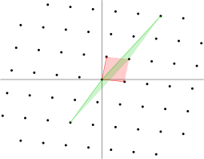

# Introduction

Lattices, also known as Minkowski's theory after Hermann Minkowski, or the geometry of numbers \(deprecated!\) allows the usage of geometrical tools \(i.e. volumes\) in number theory.

The intuitive notion of a lattice \(perhaps surprisingly\) matches its mathematical definition. For example, lattices are formed by

* points on an infinite checkerboard;
* centers of a hexagonal tessellation;
* integers on the real number line.


The last example should hint at how we generalize this concept to arbitrary dimensions. In general, lattices consist of discrete points which appear at "regular intervals."


## Definitions

A **lattice** $$L$$ is a subgroup of $$\mathbb{R}^n$$generated by $$b_i$$, i.e.

$$
L=\sum_{i=1}^d\mathbb{Z} b_i = \left\{\left. \sum_{i=1}^d a_i b_i \right | a_i \in \mathbb{Z} \right\}
$$

where $$b_i$$ are linearly independent vectors. Collectively, $$\left\{b_i\right\}_{i=1}^d$$ form a **basis** of$$L$$. 


We say a set of vectors $$v_i$$are **linearly independent** if the only solution to the equation $$\sum_{i} a_i b_i = 0$$ is when all $$a_i$$are zero. 


Taking a step back, this definition should resemble that of a vector space, with one exception: scalars are integers! The discrete nature of lattices comes from this restriction.

Some more terminology from linear algebra will be useful. The **dimension** of a lattice, denoted$$\dim L$$, is $$d$$. A lattice is **complete** if $$d=n$$. Note that we can always choose a subspace of $$\mathbb R^n$$such that the lattice is complete, namely the subspace generated by $$b_i$$.

The region

$$
\Phi=\left\{\left.\sum_{i=1}^dx_ib_i\right|0\leq x_i<1\right\}
$$

is known as the **fundamental mesh**.

In the image above, we see the points of a lattice in $$\mathbb R^2$$. The red vectors are one set of basis vectors and the shaded region is the corresponding fundamental mesh. The green vectors also form another set of basis vectors with its corresponding fundamental mesh. We see here that the basis vectors and fundamental mesh is not unique to a lattice.

Although the fundamental mesh is not unique, it turns out that the \($$m$$dimensional\) volume of the fundamental mesh is constant for any given lattice. Hence we can define the **volume** of a lattice as the volume of a fundamental mesh. However this definition can be hard to handle hence we provide an equivalent definition via determinants:

Let$$\mathcal B$$be a$$d\times n$$matrix whose rows are given by the basis vectors. Then the volume of a fundamental mesh is given by

$$
\text{vol}(L)=\sqrt{\left|\det\left(\mathcal B\mathcal B^T\right)\right|}
$$

A subset $$X$$of $$\mathbb R^n$$is known as **centrally symmetric** if $$x\in X$$implies $$-x\in X$$. It is convex if for any $$x,y\in X$$, the line joining $$x,y$$ is contained in $$X$$, i.e. $$\left\{tx+(1-t)y|0\leq t\leq1\right\}\subset X$$. Finally we can introduce the most important theorem about lattices, the **Minkowski's Lattice Point Theorem**:

Let $$L$$be a complete lattice of dimension$$n$$ and $$X$$be a centrally symmetric convex set. Suppose

$$
\text{vol}(X)>2^n\text{vol}(L)
$$

Then $$X$$contains at least one nonzero point of $$L $$. This result is primarily used to prove the existence of lattice vectors.

Throughout this section, $$\left\lVert v\right\rVert=\sqrt{\sum_iv_i^2}$$ denotes the $$\ell_2$$norm and $$\langle a,b\rangle=\sum_ia_ib_i$$ denotes the inner product.

## Proof sketch of Minkowski's theorem

This proof is by some sort of a pigeonhole argument on volumes. Consider the set 

$$
\frac12X=\left\{\frac12x|x\in X\right\}
$$

We have $$\text{vol}\left(\frac12 X\right)>\text{vol}(L)$$, hence the inclusion $$\frac12X\to\mathbb R^n/L$$cannot be injective, thus we can find some $$x_1=x_2+\ell$$, $$x_1,x_2\in\frac12 X,\ell\in L,x_1\neq x_2$$. Hence $$x_1-x_2\in L$$is a nontrivial lattice point.

## Exercises

1\) Let $$L$$be the lattice generated by $$\mathcal B=\begin{pmatrix}-1&9&8\\1&-8&-7\end{pmatrix}$$\(take the rows as basis vectors\). 

* Compute the volume of this lattice
* Show that $$\mathcal B'=\begin{pmatrix}1&0&1\\0&1&1\end{pmatrix}$$generates the same lattice 
* Show that each row in $$\mathcal C=\begin{pmatrix}1&0&1\\0&2&2\end{pmatrix}$$is in the lattice but$$\mathcal C$$does not generate the lattice. This is one key difference from the case of linear algebra \(over fields\).

2\) Let$$\mathcal B,\mathcal B'$$be $$d\times n$$matrices whose row vectors are basis for lattices $$L,L'$$. Both lattices are the same iff there exists some $$U\in\text{GL}_d(\mathbb Z)$$ such that $$\mathcal B'=U\mathcal B$$. Find $$U$$for problem 1. Note that $$\text{GL}_d(\mathbb Z)$$is the group of invertible matrices with integer coefficients, meaning $$U$$and $$U^{-1}$$have integer coefficients.

3\) Show that the condition in Minkowski's lattice point theorem is strict, i.e. for any complete lattice$$L$$of dimension $$n$$, we can find some centrally symmetric convex set$$X$$with$$\text{vol}(X)=2^n\text{vol}(L)$$but the only lattice point in$$X$$is the origin.

4\*\) Let$$v$$be the shortest nonzero vector for some lattice $$L$$with dimension$$n$$. Show that

$$
\left\lVert v\right\rVert\leq\frac2{\sqrt\pi}\Gamma\left(\frac n2+1\right)^{\frac1n}\text{vol}(L)^\frac1n
$$

