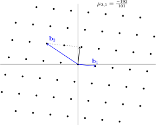
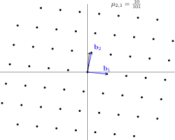

# Lagrange's algorithm

## Overview

Lagrange's algorithm, often incorrectly called Gaussian reduction, is the 2D analouge to the Euclidean algorithm and is used for lattice reduction. Intuitively, lattice reduction is the idea of finding a new basis that consists of shorter vectors. Before going into Lagrange's algorithm, we first recap the Euclidean algorithm:

```text
def euclid(m,n):
    while n!=0:
        q = round(m/n)
        m -= q*n
        if abs(n) > abs(m):
            m, n = n, m
    return abs(m)
```

The algorithm primarily consists of two steps, a reduction step where the size of $$m$$is brought down by a multiple of $$n$$and a swapping step that ensures $$m$$is always the largest number. We can adapt this idea for lattices:

```text
def lagrange(b1,b2):
    mu = 1
    while mu != 0:
        mu = round((b1*b2) / (b1*b1))
        b2 -= mu*b1
        if b1*b1 > b2*b2:
            b1, b2 = b2, b1
    return b1, b2
```

Here $$\mu$$is actually the Gram-Schmidt coefficient $$\mu_{2,1}$$and it turns out that this algorithm will always find the shortest possible basis! Using the basis

$$
\begin{matrix}
b_1&=&(-1.8,1.2)\\
b_2&=&(-3.6,2.3)
\end{matrix}
$$

the Lagrange reduction looks like






and here we see it clearly gives the shortest vectors.

## Optimality proof

Let $$L$$be a lattice. The basis $$b_1,b_2$$is defined to be the shortest for any other basis $$b_1',b_2',\left\lVert b_1'\right\rVert\leq\left\lVert b_2'\right\rVert$$, we have $$\left\lVert b_1\right\rVert\leq\left\lVert b_1'\right\rVert$$and $$\left\lVert b_2\right\rVert\leq\left\lVert b_2'\right\rVert$$. Note that this generally cannot be generalized to other dimensions, however in dimension 2, this is possible and is given by Lagrange's algorithm. The proof is a somewhat messy sequence of inequalities that eventually lead to the conclusion we want.

Let $$b_1,b_2$$be the output of the Lagrange reduction for some lattice $$L$$. To prove that Lagrange reduction gives the shortest basis, we first show that $$\left\lVert b_1\right\rVert$$is the shortest vector in $$L$$.

We know that $$\frac{\left|\langle b_1,b_2\rangle\right|}{\left\lVert b_1\right\rVert^2}\le\frac12$$from the algorithm directly. Let $$v=mb_1+nb_2\in L$$be any element in $$L$$. We first show that $$\left\lVert b_1\right\rVert\leq\left\lVert v\right\rVert$$:

$$
\begin{align*}
\left\lVert v\right\rVert^2&=\left\lVert mb_1+nb_2\right\rVert^2\\
&=m^2\left\lVert b_1\right\rVert^2+2mn\langle b_1,b_2\rangle+n^2\left\lVert b_2\right\rVert^2\\
&\geq m^2\left\lVert b_1\right\rVert^2-|mn|\left\lVert b_1\right\rVert^2+n^2\left\lVert b_1\right\rVert^2\\
&=\left(m^2-|mn|+n^2\right)\left\lVert b_1\right\rVert^2\\
\end{align*}
$$

Since $$m^2-mn+n^2=\left(m-\frac n2\right)^2+\frac34n^2$$, this quantity is only $$0$$when $$m=n=0$$and is a positive integer for all other cases, hence $$\left\lVert v\right\rVert\geq\left\lVert b_1\right\rVert$$and $$\left\lVert b_1\right\rVert$$is a shortest vector of $$L$$. Note that we can have multiple vectors with the same norm as $$b_1$$, for instance $$-b_1$$. So this is not a unique shortest vector.

Suppose there exists some basis $$b'_1,b'_2$$for $$L$$such that $$\left\lVert b_1'\right\rVert\leq\left\lVert b_2'\right\rVert$$. We show that $$\left\lVert b_2\right\rVert\leq\left\lVert b_2'\right\rVert$$. Let $$b_2'=mb_1+nb_2$$.

If $$n=0$$, then $$b_2'=\pm b_1$$as $$b_1',b_2'$$must form a basis. This means that $$\left\lVert b_1\right\rVert=\left\lVert b_1'\right\rVert=\left\lVert b_2'\right\rVert$$ and by the inequality above, we must have $$\pm b_1'=b_2$$or $$\pm b_1'=b_1+b_2$$. The first case tells us that $$\left\lVert b'_1\right\rVert=\left\lVert b_2\right\rVert$$. By squaring the second case, we get

$$
\begin{align*}
\left\lVert b'_1\right\rVert^2&=\left\lVert b_1+b_2\right\rVert^2\\
\left\lVert b'_1\right\rVert^2&=\left\lVert b_1\right\rVert^2+2\langle b_1,b_2\rangle+\left\lVert b_2\right\rVert^2\\
0&=2\langle b_1,b_2\rangle+\left\lVert b_2\right\rVert^2\\
\left\lVert b_1\right\rVert^2&\leq\left\lVert b_2\right\rVert^2\\
\end{align*}
$$

but since $$\left\lVert b_1\right\rVert$$is the shortest vector, $$\left\lVert b_1\right\rVert=\left\lVert b_2\right\rVert$$.

Otherwise, we have $$m,n\neq0$$ and $$m^2-mn+n^2\geq1$$, so

$$
\begin{align*}
\left\lVert b'_2\right\rVert^2&=m^2\left\lVert b_1\right\rVert^2+2mn\langle b_1,b_2\rangle+n^2\left\lVert b_2\right\rVert^2\\
&\geq m^2\left\lVert b_1\right\rVert^2-|mn|\left\lVert b_1\right\rVert^2+n^2\left\lVert b_2\right\rVert^2\\
&=n^2\left(\left\lVert b_2\right\rVert^2-\left\lVert b_1\right\rVert^2\right)+\left(m^2-|mn|+n^2\right)\left\lVert b_1\right\rVert^2\\
&\geq\left(n^2-1\right)\left(\left\lVert b_2\right\rVert^2-\left\lVert b_1\right\rVert^2\right)+\left\lVert b_2\right\rVert^2\\
&\geq\left\lVert b_2\right\rVert^2
\end{align*}
$$

Hence proving Lagrange's algorithm indeed gives us the shortest basis vectors.

## Exercises

1\) Show that the output of Lagrange's algorithm generate the same lattice as the input.

2\) Find a case where $$\left\lVert b_1\right\rVert=\left\lVert b_2\right\rVert=\left\lVert b_1+b_2\right\rVert$$. Notice that the vectors here is the equality case for the bound given in Exercise 4 of the introduction, this actually tells us that the optimal lattice circle packing in 2D is given by this precise lattice! It turns out that this is actually the optimal circle packing in 2D but the proof is significantly more involved. \(See [https://arxiv.org/abs/1009.4322](https://arxiv.org/abs/1009.4322) for the details\)

3\*\) Let $$\mu_{2,1}=\lfloor\mu_{2,1}\rceil+\varepsilon=\mu+\epsilon$$, show that 

$$
\left\lVert b_2\right\rVert^2\geq\left(\left(|\mu|-\frac12\right)^2-\varepsilon^2\right)\left\lVert b_1\right\rVert^2+\left\lVert b_2-\mu b_1\right\rVert
$$

and show that $$|\mu|\geq2$$for all steps in the algorithm except the first and last, hence $$\left\lVert b_1\right\rVert\left\lVert b_2\right\rVert$$decreases by at least $$\sqrt3$$ at each loop and the algorithm runs in polynomial time.

